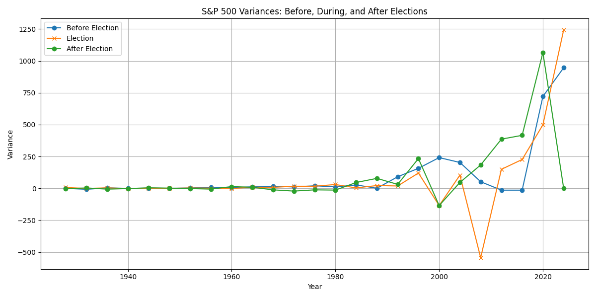
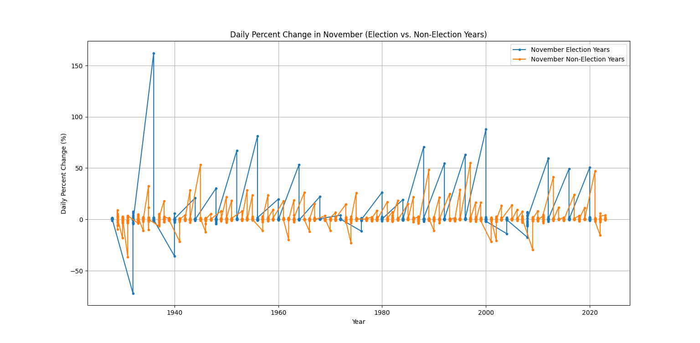

# 340-S-P-Analysis

<<<<<<< HEAD
=======

1. The general/topic and challenge the code addresses
    - The topic of this code is trying to get meaningful information from S&P Data 
        Narrowed Down Questions
        1. How does the presidential election affect the general trend of the S&P 500 compared to the years surrounding it?
          This question is interesting because we want to know more about investing and when the market trends up.
        2. How does the month of November react after the election? 
            This question is interesting because we want to know if easing political unrest increases performance for a time being.
        3. What are the pre-election trends that are common in the months leading up to the election?
            We want to know if the campaign improves or digresses in the months prior to the election.
      
2. A list of any required dependencies and additional programs
    - The required dependencies are Numpy, Matplotlib, Pandas.

3. The main programs written to analyze the data
    - The main programs written to analyze the data are called Question 1, Question 2, and Question 3 

4. A tutorial/walkthrough of how to operate the code
    - Please see comments of how to operate code inside programs, also the submitted walkthrough on canvas

5. A sample of results from the analysis
   - Sample results from Question 1
        
   - Sample results from Question 2
        
   - Sample results from Question 3 
        

6. Any limitations on running the program
    - No limitations

7. A brief discussion of future results.
    - The results of this analysis is that there are not a lot of consistent trends to see when looking at S&P values with the election

